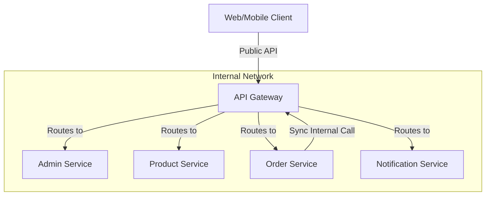

# NovaTech Microservices: Inter-Service Communication Analysis

In the **NovaTech** ecosystem, services follow a hybrid orchestration pattern where the **Order Service** acts as the primary orchestrator for critical business flows. All communication is routed through the **API Gateway**, which provides a unified internal service mesh and ensures security headers (like `x-user-id`) are consistently passed across the network.

---

## 🏗️ Architecture Overview

NovaTech uses **Synchronous HTTP (REST)** for inter-service communication. Instead of services calling each other directly on separate ports, they leverage the **API Gateway** as an internal proxy. This simplifies service discovery, as every service only needs to know the URL of the Gateway.

---

## 🛒 Real-World Scenario: The Checkout Flow

The "Checkout" process is the best example of how these services collaborate in real-time to complete a high-stakes transaction.

### Flow Step-by-Step

1.  **User Initiation**: The user clicks "Checkout" in the cart.
2.  **Gateway Entry**: The request hits `POST /api/order-orders/checkout`.
3.  **Order Service Orchestration**:
    -   **Profile Validation**: The Order Service calls the Gateway to ask the **Admin Service** if the user has a valid shipping address (`GET /api/admin-internal/profile/:id`).
    -   **Stock & Price Check**: For every item in the cart, the Order Service calls the Gateway to ask the **Product Service** for the latest price and current stock level (`GET /api/product-products/:id`).
    -   **Local Transaction**: The Order Service creates the Order and Transaction records in its local database.
    -   **Inventory Update**: Once the order is saved, the Order Service sends a request to the Gateway for the **Product Service** to reduce the physical stock level (`PATCH /api/product-internal/stock/reduce`).
    -   **User Notification**: Finally, the Order Service triggers the **Notification Service** via the Gateway to send a confirmation email to the user (`POST /api/notif-notifications/send-email`).

---

## 🎯 Comparison: API vs Internal Roles

| Service | Public Role (External) | Internal Role (Inter-service) |
| :--- | :--- | :--- |
| **API Gateway** | Entry point, Auth check | Routing hub for internal service calls |
| **Admin Service** | User registration, Login | Verification of user roles and shipping profiles |
| **Product Service** | Catalog browsing, Reviews | Inventory management and price verification |
| **Order Service** | Cart management, Order history | **Process Orchestrator** for the checkout flow |
| **Notification Service** | View notifications | Email/SMS delivery engine |

---

## 💡 Best Practices Implemented

1.  **Gateway Internal Routes**: Uses specific `/internal/` or dedicated paths in the Gateway to separate logic meant for other services versus logic meant for the public client.
2.  **Header Propagation**: The `x-user-id` and `x-user-role` headers are passed between services to maintain the security context of the user who initiated the request.
3.  **Database Per Service**: Each service manages its own data (Admin = User info, Order = Sales, Product = Inventory), ensuring there is no direct database cross-talk, which maintains loose coupling.

> [!TIP]
> **Performance Recommendation**: For very high-traffic sites, consider moving the **Notification** and **Stock Update** calls to an **Asynchronous Message Queue (like RabbitMQ or Kafka)**. This would allow the Checkout to finish faster while inventory updates and emails happen in the background.
