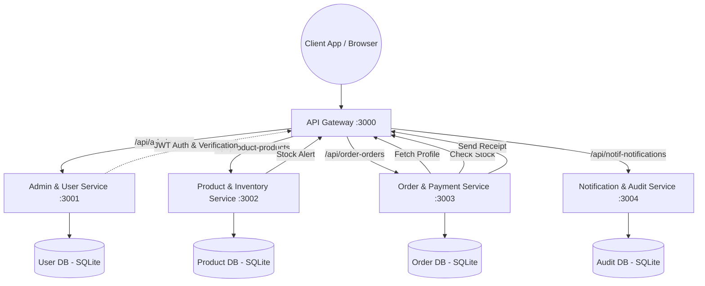

# CTSE Cloud Computing Assignment - Group Project Report

## Shared Architecture Diagram

## Description and Rationale of Microservices

### 1. Admin & User Service (Student A)
**Role:** Centralizes identity management, authentication, Role-Based Access Control (RBAC), and user profile storage.
**Integration Links:** Validates credentials. Supplies user address/profile data to the Order service to ensure the user can receive shipments.

### 2. Product & Inventory Service (Student B)
**Role:** Manages the e-commerce catalog consisting of products, categories, reviews, and real-time inventory levels.
**Integration Links:** Ensures stock integrity by receiving order-driven stock reduction calls from the Order service. If inventory drops below threshold, triggers an internal alert via the Notification service.

### 3. Order & Payment Service (Student C)
**Role:** The core business transaction heart. Maintains shopping carts and coordinates the checkout workflow.
**Integration Links:** 
- Queries Admin Service for user clearance/address.
- Queries Product Service to verify prices and stock.
- Completes the order and pushes stock reduction commands to Product Service.
- Pushes finalized receipts to the Notification Service.

### 4. Notification & Audit Service (Student D)
**Role:** Handles all outbound communication to customers (simulated Email/SMS) and maintains a global, tamper-proof internal Audit Log for high-stakes actions.
**Integration Links:** Receives alerts from Product service and receipts from Order service, keeping a synchronized system state record.

## Overview of DevOps and Security Practices

### Security & DevSecOps
- **API Gateway Guarding:** Centralized JWT verification restricts unauthorized external access. Only authenticated users receive `x-user-id` and `x-user-role` headers bridging into the microservices.
- **Micro-boundary Security:** Even internal services enforce an RBAC guard logic to reject forged roles if improperly proxied.
- **Least Privilege Principle:** Each container runs isolated with its dedicated SQLite database instance; no service can mutate another's database directly.
- **Code Scans:** CI/CD files integrate mocked stubs for **Snyk** (dependency vulnerability checks) and **SonarCloud** (SAST capabilities).

### DevOps
- **Containerization:** Multistage `Dockerfile` defined for each service isolating build and deployment.
- **CI/CD Automation:** GitHub Actions (`.github/workflows/main.yml`) orchestrate automatic builds and tests per service directory triggered upon code pushes.

## Challenges Faced & Addressed
1. **Challenge:** Synchronizing distributed transactions (stock reservation vs order creation).
   **Solution:** Built an orchestration checkout flow in the Order service that gracefully reverts or halts processing if upstream checks fail.
2. **Challenge:** Propagating user identity. 
   **Solution:** Adopted the gateway offloading pattern where the Gateway decodes JWTs and forwards secure custom headers.
